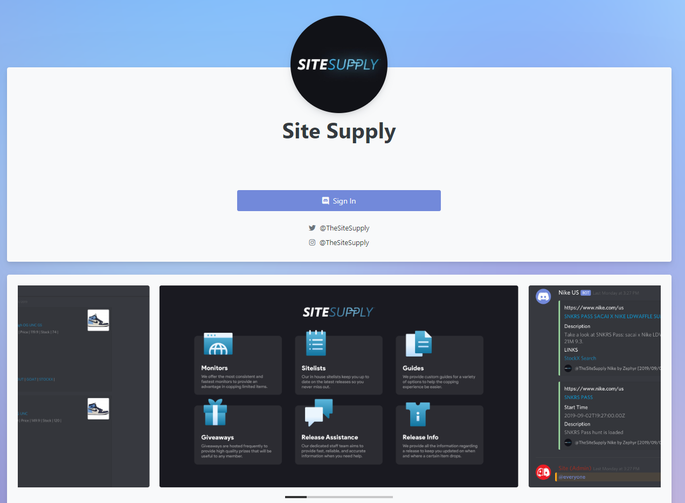

# Welcome to Site Supply!

## Who Are We?

Site Supply is an exclusive community centered around streetwear, sneakers, and most things that you'd be able to profit off of. We offer monitors for 200+ sites, early info, release guides, 1-on-1 support and much more so we can help you make thousands each month! Your monthly membership doesn't guarantee success but we do everything in our power to help improve your chances to score on every release within your subscription date. We have been in the community as a group for over three years now and have grown much more than we initially expected. We hope to see you around for a long time as some of our current members have been with us from the very start.

## Membership

In order to have access to all of our amazing features, you **must** be a paying member. You can view the status of your subscription at [https://member.sitesupply.co/](https://member.sitesupply.co/)  
  
Here you will be able to cancel your membership, update your billing, re-activate your membership, and check your billing date. All of your information is secure and you are the only individual who has access to it. This is the **only** place where you can edit your subscription.   
  
Your membership operates on a 30-day basis \(unless you're a lifetime member\), which means that every 30 days our billing system will check for payment from you. If you have cancelled your membership and/or have invalid billing details, you will be removed from the group at the end of your 30 days. If you ever decide to cancel your membership, you will always have the opportunity to reactivate your membership at any point in time via this user dashboard.  
  

